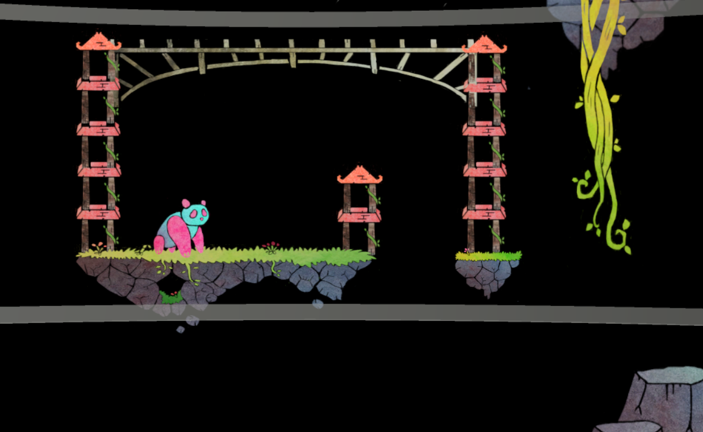
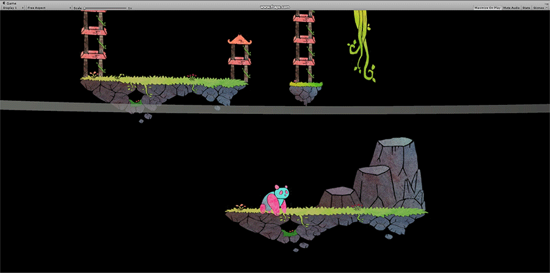
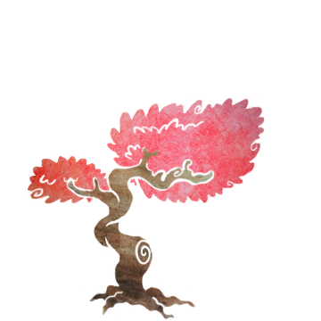
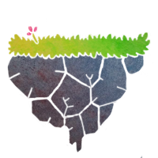
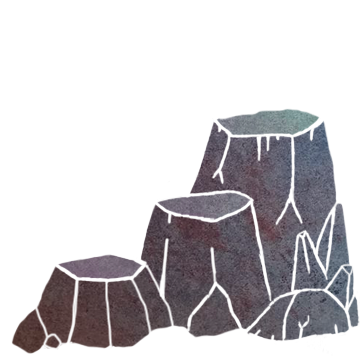
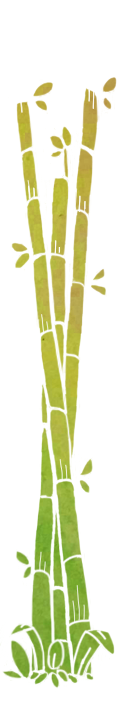
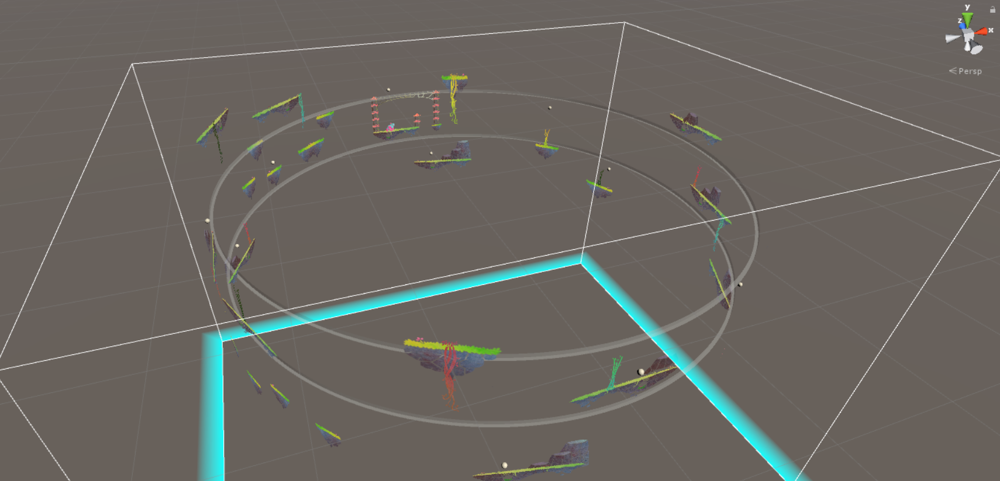
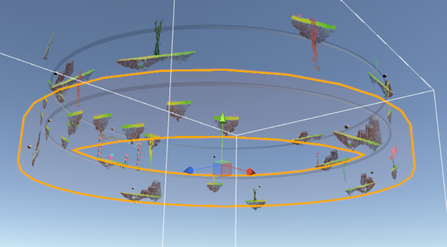
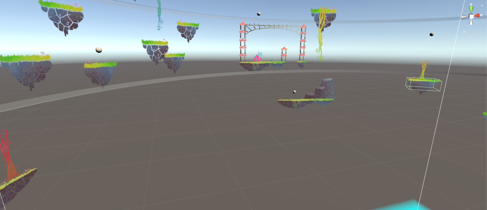

# The Last Panda

The Last Panda is a 2 players Coop Game created during the [Global Game Jam Montreal](http://globalgamejam.org/). 
The challenge was to make a game in 48h.
- Montreal
- January 20, 2017

# Gameplay
Panda's babies are lost on the wild and Dady must bring them back home! (Otherwise, who will eat the bamboo!...)?
As soon as Dady panda gets all his babies, players win.
But panda may falls down or even gits hurt by a by a terrible wave!
Then, shame on the players and you lose.

## Panda player
**Controls dady Panda**.
It has simple behaviors like moving (Left,right), jumping and climbing ladders. 
Unfortunately, some places are unreachable and panda needs help from the second player.

## VR player
**Helps panda player**.
He is 'inside' the game platform.
He must help the Panda player by moving platforms so that Dady panda can reach other places.
The map is divided by 3 rings, you can't move the one where panda is currently.
Important communication skills are required to inform panda about events, platform disposition...
(For example, to warn if he can jump down).

## Waves
Things are easy so far, but well, we've got some company!
Several waves randomly pop out and rise from the ground.
Their hight are random but upper ring is always safe.
It's VR player's goal to warn poor panda about this terrible events.

# Animations

# Graphics
Hand made by Tom, using pastel colors only.

)

# Behind the Unity
> Made with Unity 5.5

A challenge we faced was to create a 2D space for a 3D Virtual Reality environment.
We end up using this "ring" representation where VR player is actually in the middle whereas Panda player has a 'fake' 2D platformer view.

# Authors
- [Geekymoose](https://github.com/GeekyMoose) - Programmer
- [Yvan d'Alyse](https://github.com/Yvanovitch) - Programmer VR
- Tom Seguin - 2D artist
- Carlyne Poizeau - Sound designer
- Jamie Dorval Caya - Game Designer
- JF Morin - Game designer

# Final note
Look at these little pandas... You should help Dady to bring them back home! (Where there is plenty of bamboos!)

